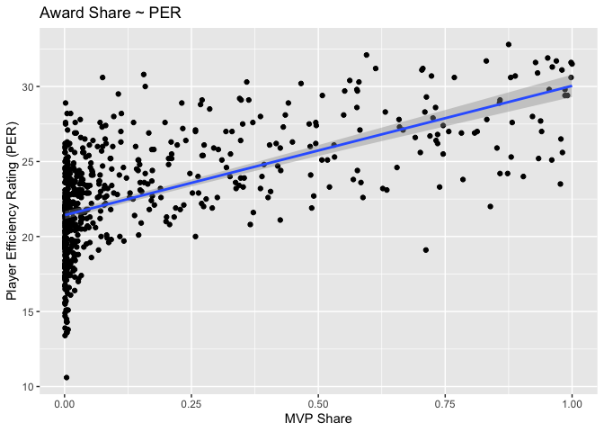

# NBA Analysis

### Author: David Suryanto

## Project Goal: Predict The 2023 NBA MVP

## Dataset:

Please see <https://www.basketball-reference.com/about/glossary.html> for info on variables

## Sample Tables:

| Year | Player                | Pos | Team                  |  PTS |  AST |  TRB |
|-----:|:----------------------|:----|:----------------------|-----:|-----:|-----:|
| 2021 | Nikola Jokić          | C   | Denver Nuggets        | 26.4 |  8.3 | 10.8 |
| 2020 | Giannis Antetokounmpo | PF  | Milwaukee Bucks       | 29.5 |  5.6 | 13.6 |
| 2019 | Giannis Antetokounmpo | PF  | Milwaukee Bucks       | 27.7 |  5.9 | 12.5 |
| 2018 | James Harden          | SG  | Houston Rockets       | 30.4 |  8.8 |  5.4 |
| 2017 | Russell Westbrook     | PG  | Oklahoma City Thunder | 31.6 | 10.4 | 10.7 |

Table 1: Recent NBA MVPs

| Year | Player        | Pos | Team               |  PTS |
|-----:|:--------------|:----|:-------------------|-----:|
| 2005 | Steve Nash    | PG  | Phoenix Suns       | 15.5 |
| 2006 | Steve Nash    | PG  | Phoenix Suns       | 18.8 |
| 1990 | Magic Johnson | PG  | Los Angeles Lakers | 22.3 |
| 1989 | Magic Johnson | PG  | Los Angeles Lakers | 22.5 |
| 2003 | Tim Duncan    | PF  | San Antonio Spurs  | 23.3 |

Table 2: MVPs with Lowest PPG

### **Table 1: MVP Winners (1982-2022)**

| season | player                | pos | Team                   | pts_per_g | ast_per_g | trb_per_g | stl_per_g | blk_per_g |
|-------:|:----------------------|:----|:-----------------------|----------:|----------:|----------:|----------:|----------:|
|   2022 | Nikola Jokić          | C   | Denver Nuggets         |      27.1 |       7.9 |      13.8 |       1.5 |       0.9 |
|   2021 | Nikola Jokić          | C   | Denver Nuggets         |      26.4 |       8.3 |      10.8 |       1.3 |       0.7 |
|   2020 | Giannis Antetokounmpo | PF  | Milwaukee Bucks        |      29.5 |       5.6 |      13.6 |       1.0 |       1.0 |
|   2019 | Giannis Antetokounmpo | PF  | Milwaukee Bucks        |      27.7 |       5.9 |      12.5 |       1.3 |       1.5 |
|   2018 | James Harden          | SG  | Houston Rockets        |      30.4 |       8.8 |       5.4 |       1.8 |       0.7 |
|   2017 | Russell Westbrook     | PG  | Oklahoma City Thunder  |      31.6 |      10.4 |      10.7 |       1.6 |       0.4 |
|   2016 | Stephen Curry         | PG  | Golden State Warriors  |      30.1 |       6.7 |       5.4 |       2.1 |       0.2 |
|   2015 | Stephen Curry         | PG  | Golden State Warriors  |      23.8 |       7.7 |       4.3 |       2.0 |       0.2 |
|   2014 | Kevin Durant          | SF  | Oklahoma City Thunder  |      32.0 |       5.5 |       7.4 |       1.3 |       0.7 |
|   2013 | LeBron James          | PF  | Miami Heat             |      26.8 |       7.3 |       8.0 |       1.7 |       0.9 |
|   2012 | LeBron James          | SF  | Miami Heat             |      27.1 |       6.2 |       7.9 |       1.9 |       0.8 |
|   2011 | Derrick Rose          | PG  | Chicago Bulls          |      25.0 |       7.7 |       4.1 |       1.0 |       0.6 |
|   2010 | LeBron James          | SF  | Cleveland Cavaliers    |      29.7 |       8.6 |       7.3 |       1.6 |       1.0 |
|   2009 | LeBron James          | SF  | Cleveland Cavaliers    |      28.4 |       7.2 |       7.6 |       1.7 |       1.1 |
|   2008 | Kobe Bryant           | SG  | Los Angeles Lakers     |      28.3 |       5.4 |       6.3 |       1.8 |       0.5 |
|   2007 | Dirk Nowitzki         | PF  | Dallas Mavericks       |      24.6 |       3.4 |       8.9 |       0.7 |       0.8 |
|   2006 | LeBron James          | SF  | Cleveland Cavaliers    |      31.4 |       6.6 |       7.0 |       1.6 |       0.8 |
|   2005 | Shaquille O’Neal      | C   | Miami Heat             |      22.9 |       2.7 |      10.4 |       0.5 |       2.3 |
|   2004 | Kevin Garnett         | PF  | Minnesota Timberwolves |      24.2 |       5.0 |      13.9 |       1.5 |       2.2 |
|   2003 | Tim Duncan            | PF  | San Antonio Spurs      |      23.3 |       3.9 |      12.9 |       0.7 |       2.9 |
|   2002 | Tim Duncan            | PF  | San Antonio Spurs      |      25.5 |       3.7 |      12.7 |       0.7 |       2.5 |
|   2001 | Allen Iverson         | SG  | Philadelphia 76ers     |      31.1 |       4.6 |       3.8 |       2.5 |       0.3 |
|   2000 | Shaquille O’Neal      | C   | Los Angeles Lakers     |      29.7 |       3.8 |      13.6 |       0.5 |       3.0 |
|   1999 | Karl Malone           | PF  | Utah Jazz              |      23.8 |       4.1 |       9.4 |       1.3 |       0.6 |
|   1998 | Michael Jordan        | SG  | Chicago Bulls          |      28.7 |       3.5 |       5.8 |       1.7 |       0.5 |
|   1997 | Karl Malone           | PF  | Utah Jazz              |      27.4 |       4.5 |       9.9 |       1.4 |       0.6 |
|   1996 | Michael Jordan        | SG  | Chicago Bulls          |      30.4 |       4.3 |       6.6 |       2.2 |       0.5 |
|   1995 | David Robinson        | C   | San Antonio Spurs      |      27.6 |       2.9 |      10.8 |       1.7 |       3.2 |
|   1994 | Hakeem Olajuwon       | C   | Houston Rockets        |      27.3 |       3.6 |      11.9 |       1.6 |       3.7 |
|   1993 | Hakeem Olajuwon       | C   | Houston Rockets        |      26.1 |       3.5 |      13.0 |       1.8 |       4.2 |
|   1992 | Michael Jordan        | SG  | Chicago Bulls          |      30.1 |       6.1 |       6.4 |       2.3 |       0.9 |
|   1991 | Michael Jordan        | SG  | Chicago Bulls          |      31.5 |       5.5 |       6.0 |       2.7 |       1.0 |
|   1990 | Magic Johnson         | PG  | Los Angeles Lakers     |      22.3 |      11.5 |       6.6 |       1.7 |       0.4 |
|   1989 | Magic Johnson         | PG  | Los Angeles Lakers     |      22.5 |      12.8 |       7.9 |       1.8 |       0.3 |
|   1988 | Michael Jordan        | SG  | Chicago Bulls          |      35.0 |       5.9 |       5.5 |       3.2 |       1.6 |
|   1987 | Magic Johnson         | PG  | Los Angeles Lakers     |      23.9 |      12.2 |       6.3 |       1.7 |       0.5 |
|   1986 | Larry Bird            | SF  | Boston Celtics         |      25.8 |       6.8 |       9.8 |       2.0 |       0.6 |
|   1985 | Larry Bird            | SF  | Boston Celtics         |      28.7 |       6.6 |      10.5 |       1.6 |       1.2 |
|   1984 | Larry Bird            | PF  | Boston Celtics         |      24.2 |       6.6 |      10.1 |       1.8 |       0.9 |
|   1983 | Moses Malone          | C   | Philadelphia 76ers     |      24.5 |       1.3 |      15.3 |       1.1 |       2.0 |
|   1982 | Moses Malone          | C   | Houston Rockets        |      31.1 |       1.8 |      14.7 |       0.9 |       1.5 |

### **Table 2: MVPs Win/Loss Percentage**

| player                | Team                   | season | win_loss_pct | mvp  |
|:----------------------|:-----------------------|-------:|-------------:|:-----|
| Stephen Curry         | Golden State Warriors  |   2016 |        0.890 | TRUE |
| Michael Jordan        | Chicago Bulls          |   1996 |        0.878 | TRUE |
| Larry Bird            | Boston Celtics         |   1986 |        0.817 | TRUE |
| Michael Jordan        | Chicago Bulls          |   1992 |        0.817 | TRUE |
| Dirk Nowitzki         | Dallas Mavericks       |   2007 |        0.817 | TRUE |
| Stephen Curry         | Golden State Warriors  |   2015 |        0.817 | TRUE |
| Shaquille O’Neal      | Los Angeles Lakers     |   2000 |        0.817 | TRUE |
| LeBron James          | Cleveland Cavaliers    |   2009 |        0.805 | TRUE |
| LeBron James          | Miami Heat             |   2013 |        0.805 | TRUE |
| James Harden          | Houston Rockets        |   2018 |        0.793 | TRUE |
| Magic Johnson         | Los Angeles Lakers     |   1987 |        0.793 | TRUE |
| Moses Malone          | Philadelphia 76ers     |   1983 |        0.793 | TRUE |
| Karl Malone           | Utah Jazz              |   1997 |        0.780 | TRUE |
| Larry Bird            | Boston Celtics         |   1985 |        0.768 | TRUE |
| Magic Johnson         | Los Angeles Lakers     |   1990 |        0.768 | TRUE |
| Giannis Antetokounmpo | Milwaukee Bucks        |   2020 |        0.767 | TRUE |
| Larry Bird            | Boston Celtics         |   1984 |        0.756 | TRUE |
| Derrick Rose          | Chicago Bulls          |   2011 |        0.756 | TRUE |
| Michael Jordan        | Chicago Bulls          |   1998 |        0.756 | TRUE |
| David Robinson        | San Antonio Spurs      |   1995 |        0.756 | TRUE |
| Michael Jordan        | Chicago Bulls          |   1991 |        0.744 | TRUE |
| LeBron James          | Cleveland Cavaliers    |   2010 |        0.744 | TRUE |
| Karl Malone           | Utah Jazz              |   1999 |        0.740 | TRUE |
| Giannis Antetokounmpo | Milwaukee Bucks        |   2019 |        0.732 | TRUE |
| Tim Duncan            | San Antonio Spurs      |   2003 |        0.732 | TRUE |
| Shaquille O’Neal      | Miami Heat             |   2005 |        0.720 | TRUE |
| Kevin Durant          | Oklahoma City Thunder  |   2014 |        0.720 | TRUE |
| Hakeem Olajuwon       | Houston Rockets        |   1994 |        0.707 | TRUE |
| Kevin Garnett         | Minnesota Timberwolves |   2004 |        0.707 | TRUE |
| Tim Duncan            | San Antonio Spurs      |   2002 |        0.707 | TRUE |
| LeBron James          | Miami Heat             |   2012 |        0.697 | TRUE |
| Kobe Bryant           | Los Angeles Lakers     |   2008 |        0.695 | TRUE |
| Magic Johnson         | Los Angeles Lakers     |   1989 |        0.695 | TRUE |
| Allen Iverson         | Philadelphia 76ers     |   2001 |        0.683 | TRUE |
| Hakeem Olajuwon       | Houston Rockets        |   1993 |        0.671 | TRUE |
| Nikola Jokić          | Denver Nuggets         |   2021 |        0.653 | TRUE |
| Michael Jordan        | Chicago Bulls          |   1988 |        0.610 | TRUE |
| LeBron James          | Cleveland Cavaliers    |   2006 |        0.610 | TRUE |
| Nikola Jokić          | Denver Nuggets         |   2022 |        0.585 | TRUE |
| Russell Westbrook     | Oklahoma City Thunder  |   2017 |        0.573 | TRUE |
| Moses Malone          | Houston Rockets        |   1982 |        0.561 | TRUE |

Note: Only 11 out of the 41 (26.8%) MVP winners from 1982-2022 have win/loss percentage below 70% and only 3 of them are below 60%.

### **Graph: Correlation Between MVP Share and PER rating**

Note: MVPs average PER rating = 28.3 and Non-MVPs average PER rating = 12.7. This proves how crucial it is for NBA players to have a high PER rating in order to be considered in the MVP race.

### **Graph:** Correlation Between MVP Share and Win Share

Note: MVPs average win share = 16.02 and Non-MVPs average win share = 2.62. This proves how crucial it is for NBA players to have a high win share % in order to be considered in the MVP race.

### **Graph: Correlation Between MVP Share and True Shooting %**

Note: MVPs average true shooting(%) = 59.3% and Non-MVPs average true shooting(%) = 51.3%. This proves how crucial it is for NBA players to have a high true shooting % in order to be considered in the MVP race.

### 
