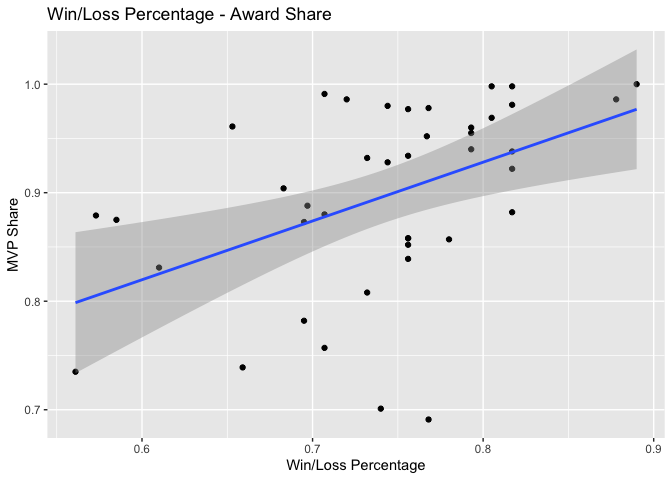

# NBA Analysis

### Author: David Suryanto

## Project Goal: Predict The 2023 NBA MVP

## Dataset:

Please see
<https://www.kaggle.com/datasets/robertsunderhaft/nba-player-season-statistics-with-mvp-win-share>
for the data set on NBA players (1982-2022) and information on variables

### **Table 1: MVP Winners (1982-2022)**

| season | player                | pos | Team                   | pts_per_g | ast_per_g | trb_per_g | stl_per_g | blk_per_g |
|-----:|:-------------|:---|:--------------|------:|------:|------:|------:|------:|
|   2022 | Nikola Jokić          | C   | Denver Nuggets         |      27.1 |       7.9 |      13.8 |       1.5 |       0.9 |
|   2021 | Nikola Jokić          | C   | Denver Nuggets         |      26.4 |       8.3 |      10.8 |       1.3 |       0.7 |
|   2020 | Giannis Antetokounmpo | PF  | Milwaukee Bucks        |      29.5 |       5.6 |      13.6 |       1.0 |       1.0 |
|   2019 | Giannis Antetokounmpo | PF  | Milwaukee Bucks        |      27.7 |       5.9 |      12.5 |       1.3 |       1.5 |
|   2018 | James Harden          | SG  | Houston Rockets        |      30.4 |       8.8 |       5.4 |       1.8 |       0.7 |
|   2017 | Russell Westbrook     | PG  | Oklahoma City Thunder  |      31.6 |      10.4 |      10.7 |       1.6 |       0.4 |
|   2016 | Stephen Curry         | PG  | Golden State Warriors  |      30.1 |       6.7 |       5.4 |       2.1 |       0.2 |
|   2015 | Stephen Curry         | PG  | Golden State Warriors  |      23.8 |       7.7 |       4.3 |       2.0 |       0.2 |
|   2014 | Kevin Durant          | SF  | Oklahoma City Thunder  |      32.0 |       5.5 |       7.4 |       1.3 |       0.7 |
|   2013 | LeBron James          | PF  | Miami Heat             |      26.8 |       7.3 |       8.0 |       1.7 |       0.9 |
|   2012 | LeBron James          | SF  | Miami Heat             |      27.1 |       6.2 |       7.9 |       1.9 |       0.8 |
|   2011 | Derrick Rose          | PG  | Chicago Bulls          |      25.0 |       7.7 |       4.1 |       1.0 |       0.6 |
|   2010 | LeBron James          | SF  | Cleveland Cavaliers    |      29.7 |       8.6 |       7.3 |       1.6 |       1.0 |
|   2009 | LeBron James          | SF  | Cleveland Cavaliers    |      28.4 |       7.2 |       7.6 |       1.7 |       1.1 |
|   2008 | Kobe Bryant           | SG  | Los Angeles Lakers     |      28.3 |       5.4 |       6.3 |       1.8 |       0.5 |
|   2007 | Dirk Nowitzki         | PF  | Dallas Mavericks       |      24.6 |       3.4 |       8.9 |       0.7 |       0.8 |
|   2006 | Steve Nash            | PG  | Phoenix Suns           |      18.8 |      10.5 |       4.2 |       0.8 |       0.2 |
|   2005 | Steve Nash            | PG  | Phoenix Suns           |      15.5 |      11.5 |       3.3 |       1.0 |       0.1 |
|   2004 | Kevin Garnett         | PF  | Minnesota Timberwolves |      24.2 |       5.0 |      13.9 |       1.5 |       2.2 |
|   2003 | Tim Duncan            | PF  | San Antonio Spurs      |      23.3 |       3.9 |      12.9 |       0.7 |       2.9 |
|   2002 | Tim Duncan            | PF  | San Antonio Spurs      |      25.5 |       3.7 |      12.7 |       0.7 |       2.5 |
|   2001 | Allen Iverson         | SG  | Philadelphia 76ers     |      31.1 |       4.6 |       3.8 |       2.5 |       0.3 |
|   2000 | Shaquille O’Neal      | C   | Los Angeles Lakers     |      29.7 |       3.8 |      13.6 |       0.5 |       3.0 |
|   1999 | Karl Malone           | PF  | Utah Jazz              |      23.8 |       4.1 |       9.4 |       1.3 |       0.6 |
|   1998 | Michael Jordan        | SG  | Chicago Bulls          |      28.7 |       3.5 |       5.8 |       1.7 |       0.5 |
|   1997 | Karl Malone           | PF  | Utah Jazz              |      27.4 |       4.5 |       9.9 |       1.4 |       0.6 |
|   1996 | Michael Jordan        | SG  | Chicago Bulls          |      30.4 |       4.3 |       6.6 |       2.2 |       0.5 |
|   1995 | David Robinson        | C   | San Antonio Spurs      |      27.6 |       2.9 |      10.8 |       1.7 |       3.2 |
|   1994 | Hakeem Olajuwon       | C   | Houston Rockets        |      27.3 |       3.6 |      11.9 |       1.6 |       3.7 |
|   1993 | Charles Barkley       | PF  | Phoenix Suns           |      25.6 |       5.1 |      12.2 |       1.6 |       1.0 |
|   1992 | Michael Jordan        | SG  | Chicago Bulls          |      30.1 |       6.1 |       6.4 |       2.3 |       0.9 |
|   1991 | Michael Jordan        | SG  | Chicago Bulls          |      31.5 |       5.5 |       6.0 |       2.7 |       1.0 |
|   1990 | Magic Johnson         | PG  | Los Angeles Lakers     |      22.3 |      11.5 |       6.6 |       1.7 |       0.4 |
|   1989 | Magic Johnson         | PG  | Los Angeles Lakers     |      22.5 |      12.8 |       7.9 |       1.8 |       0.3 |
|   1988 | Michael Jordan        | SG  | Chicago Bulls          |      35.0 |       5.9 |       5.5 |       3.2 |       1.6 |
|   1987 | Magic Johnson         | PG  | Los Angeles Lakers     |      23.9 |      12.2 |       6.3 |       1.7 |       0.5 |
|   1986 | Larry Bird            | SF  | Boston Celtics         |      25.8 |       6.8 |       9.8 |       2.0 |       0.6 |
|   1985 | Larry Bird            | SF  | Boston Celtics         |      28.7 |       6.6 |      10.5 |       1.6 |       1.2 |
|   1984 | Larry Bird            | PF  | Boston Celtics         |      24.2 |       6.6 |      10.1 |       1.8 |       0.9 |
|   1983 | Moses Malone          | C   | Philadelphia 76ers     |      24.5 |       1.3 |      15.3 |       1.1 |       2.0 |
|   1982 | Moses Malone          | C   | Houston Rockets        |      31.1 |       1.8 |      14.7 |       0.9 |       1.5 |

### **Table 2: MVPs Win/Loss Percentage**

| player                | Team                   | season | win_loss_pct | mvp  |
|:----------------------|:-----------------------|-------:|-------------:|:-----|
| Stephen Curry         | Golden State Warriors  |   2016 |        0.890 | TRUE |
| Michael Jordan        | Chicago Bulls          |   1996 |        0.878 | TRUE |
| Larry Bird            | Boston Celtics         |   1986 |        0.817 | TRUE |
| Michael Jordan        | Chicago Bulls          |   1992 |        0.817 | TRUE |
| Dirk Nowitzki         | Dallas Mavericks       |   2007 |        0.817 | TRUE |
| Stephen Curry         | Golden State Warriors  |   2015 |        0.817 | TRUE |
| Shaquille O’Neal      | Los Angeles Lakers     |   2000 |        0.817 | TRUE |
| LeBron James          | Cleveland Cavaliers    |   2009 |        0.805 | TRUE |
| LeBron James          | Miami Heat             |   2013 |        0.805 | TRUE |
| James Harden          | Houston Rockets        |   2018 |        0.793 | TRUE |
| Magic Johnson         | Los Angeles Lakers     |   1987 |        0.793 | TRUE |
| Moses Malone          | Philadelphia 76ers     |   1983 |        0.793 | TRUE |
| Karl Malone           | Utah Jazz              |   1997 |        0.780 | TRUE |
| Larry Bird            | Boston Celtics         |   1985 |        0.768 | TRUE |
| Magic Johnson         | Los Angeles Lakers     |   1990 |        0.768 | TRUE |
| Giannis Antetokounmpo | Milwaukee Bucks        |   2020 |        0.767 | TRUE |
| Larry Bird            | Boston Celtics         |   1984 |        0.756 | TRUE |
| Michael Jordan        | Chicago Bulls          |   1998 |        0.756 | TRUE |
| Derrick Rose          | Chicago Bulls          |   2011 |        0.756 | TRUE |
| Charles Barkley       | Phoenix Suns           |   1993 |        0.756 | TRUE |
| Steve Nash            | Phoenix Suns           |   2005 |        0.756 | TRUE |
| David Robinson        | San Antonio Spurs      |   1995 |        0.756 | TRUE |
| Michael Jordan        | Chicago Bulls          |   1991 |        0.744 | TRUE |
| LeBron James          | Cleveland Cavaliers    |   2010 |        0.744 | TRUE |
| Karl Malone           | Utah Jazz              |   1999 |        0.740 | TRUE |
| Giannis Antetokounmpo | Milwaukee Bucks        |   2019 |        0.732 | TRUE |
| Tim Duncan            | San Antonio Spurs      |   2003 |        0.732 | TRUE |
| Kevin Durant          | Oklahoma City Thunder  |   2014 |        0.720 | TRUE |
| Hakeem Olajuwon       | Houston Rockets        |   1994 |        0.707 | TRUE |
| Kevin Garnett         | Minnesota Timberwolves |   2004 |        0.707 | TRUE |
| Tim Duncan            | San Antonio Spurs      |   2002 |        0.707 | TRUE |
| LeBron James          | Miami Heat             |   2012 |        0.697 | TRUE |
| Magic Johnson         | Los Angeles Lakers     |   1989 |        0.695 | TRUE |
| Kobe Bryant           | Los Angeles Lakers     |   2008 |        0.695 | TRUE |
| Allen Iverson         | Philadelphia 76ers     |   2001 |        0.683 | TRUE |
| Steve Nash            | Phoenix Suns           |   2006 |        0.659 | TRUE |
| Nikola Jokić          | Denver Nuggets         |   2021 |        0.653 | TRUE |
| Michael Jordan        | Chicago Bulls          |   1988 |        0.610 | TRUE |
| Nikola Jokić          | Denver Nuggets         |   2022 |        0.585 | TRUE |
| Russell Westbrook     | Oklahoma City Thunder  |   2017 |        0.573 | TRUE |
| Moses Malone          | Houston Rockets        |   1982 |        0.561 | TRUE |

Note: Only 11 out of the 41 (26.8%) MVP winners from 1982-2022 have
win/loss percentage below 70% and only 3 of them are below 60%.

### **Graph: Correlation Between MVP Share and PER rating**

Note: MVPs average PER rating = 28.3 and Non-MVPs average PER rating =
12.7. This proves how crucial it is for NBA players to have a high PER
rating in order to be considered in the MVP race.

### **Graph:** Correlation Between MVP Share and Win Share

Note: MVPs average win share = 16.02 and Non-MVPs average win share =
2.62. This proves how crucial it is for NBA players to have a high win
share % in order to be considered in the MVP race.

### **Graph: Correlation Between MVP Share and True Shooting %**

Note: MVPs average true shooting(%) = 59.3% and Non-MVPs average true
shooting(%) = 51.3%. This proves how crucial it is for NBA players to
have a high true shooting % in order to be considered in the MVP race.

### **Decision Tree Model**

> formula \<- award_share \~ mp_per_g + g + pts_per_g + trb_per_g +
> ast_per_g + stl_per_g + blk_per_g + fg_pct + win_loss_pct + per +
> ows + dws + ws_per_48 + obpm + dbpm + ts_pct
>
> tree_model \<- rpart(formula, data = train_data)

### **Testing the Decision Tree Model for the Highest Predicted MVP Award Share and Actual MVP Winners for each year**

|       | Season | Player                | Team                   | Predicted_Award_Share | Actual_MVP |
|:-----|------:|:----------------|:-----------------|----------------:|:--------|
| 11475 |   1982 | Julius Erving         | Philadelphia 76ers     |             0.7509286 | FALSE      |
| 11489 |   1983 | Moses Malone          | Philadelphia 76ers     |             0.7509286 | TRUE       |
| 1179  |   1984 | Larry Bird            | Boston Celtics         |             0.7509286 | TRUE       |
| 1191  |   1985 | Larry Bird            | Boston Celtics         |             0.7509286 | TRUE       |
| 1204  |   1986 | Larry Bird            | Boston Celtics         |             0.7509286 | TRUE       |
| 7240  |   1987 | Magic Johnson         | Los Angeles Lakers     |             0.8342941 | TRUE       |
| 2219  |   1988 | Michael Jordan        | Chicago Bulls          |             0.8342941 | TRUE       |
| 2231  |   1989 | Michael Jordan        | Chicago Bulls          |             0.8342941 | FALSE      |
| 2243  |   1990 | Michael Jordan        | Chicago Bulls          |             0.8342941 | FALSE      |
| 2256  |   1991 | Michael Jordan        | Chicago Bulls          |             0.8342941 | TRUE       |
| 2267  |   1992 | Michael Jordan        | Chicago Bulls          |             0.8342941 | TRUE       |
| 2280  |   1993 | Michael Jordan        | Chicago Bulls          |             0.8342941 | FALSE      |
| 13806 |   1994 | David Robinson        | San Antonio Spurs      |             0.8342941 | FALSE      |
| 13820 |   1995 | David Robinson        | San Antonio Spurs      |             0.8342941 | TRUE       |
| 2324  |   1996 | Michael Jordan        | Chicago Bulls          |             0.8342941 | TRUE       |
| 2337  |   1997 | Michael Jordan        | Chicago Bulls          |             0.8342941 | FALSE      |
| 2352  |   1998 | Michael Jordan        | Chicago Bulls          |             0.7509286 | TRUE       |
| 13862 |   1999 | Tim Duncan            | San Antonio Spurs      |             0.7509286 | FALSE      |
| 7413  |   2000 | Shaquille O’Neal      | Los Angeles Lakers     |             0.8342941 | TRUE       |
| 13892 |   2001 | Tim Duncan            | San Antonio Spurs      |             0.7509286 | FALSE      |
| 13907 |   2002 | Tim Duncan            | San Antonio Spurs      |             0.5092500 | TRUE       |
| 13922 |   2003 | Tim Duncan            | San Antonio Spurs      |             0.7509286 | TRUE       |
| 9346  |   2004 | Kevin Garnett         | Minnesota Timberwolves |             0.7509286 | TRUE       |
| 3540  |   2005 | Dirk Nowitzki         | Dallas Mavericks       |             0.7509286 | FALSE      |
| 3007  |   2006 | LeBron James          | Cleveland Cavaliers    |             0.5092500 | FALSE      |
| 3571  |   2007 | Dirk Nowitzki         | Dallas Mavericks       |             0.8342941 | TRUE       |
| 9656  |   2008 | Chris Paul            | New Orleans Pelicans   |             0.8342941 | FALSE      |
| 3044  |   2009 | LeBron James          | Cleveland Cavaliers    |             0.8342941 | TRUE       |
| 3059  |   2010 | LeBron James          | Cleveland Cavaliers    |             0.8342941 | TRUE       |
| 2527  |   2011 | Derrick Rose          | Chicago Bulls          |             0.7509286 | TRUE       |
| 8454  |   2012 | LeBron James          | Miami Heat             |             0.7509286 | TRUE       |
| 8469  |   2013 | LeBron James          | Miami Heat             |             0.8342941 | TRUE       |
| 8482  |   2014 | LeBron James          | Miami Heat             |             0.8342941 | FALSE      |
| 5329  |   2015 | Stephen Curry         | Golden State Warriors  |             0.8342941 | TRUE       |
| 5345  |   2016 | Stephen Curry         | Golden State Warriors  |             0.8342941 | TRUE       |
| 14137 |   2017 | Kawhi Leonard         | San Antonio Spurs      |             0.7509286 | FALSE      |
| 5934  |   2018 | James Harden          | Houston Rockets        |             0.8342941 | TRUE       |
| 9101  |   2019 | Giannis Antetokounmpo | Milwaukee Bucks        |             0.7509286 | TRUE       |
| 9116  |   2020 | Giannis Antetokounmpo | Milwaukee Bucks        |             0.7509286 | TRUE       |
| 4311  |   2021 | Nikola Jokić          | Denver Nuggets         |             0.8342941 | TRUE       |
| 4329  |   2022 | Nikola Jokić          | Denver Nuggets         |             0.8342941 | TRUE       |

Note: Only 28 out of the 41 **(68%)** predicted results match the actual
winners

### **Top 5 Predicted 2023 MVP Candidates (Decision Tree)**

|     | Player                | Team               | Predicted_Award_Share |
|:----|:----------------------|:-------------------|----------------------:|
| 149 | Nikola Jokić          | Denver Nuggets     |             0.8342941 |
| 435 | Joel Embiid           | Philadelphia 76ers |             0.3402222 |
| 26  | Jayson Tatum          | Boston Celtics     |             0.3095882 |
| 338 | Giannis Antetokounmpo | Milwaukee Bucks    |             0.3095882 |
| 235 | Tyrese Haliburton     | Indiana Pacers     |             0.2175000 |

Predicted Winner: Nikola Jokic

### **Linear Regression Model**

> lm_model \<- lm(award_share \~ mp_per_g + pts_per_g + trb_per_g +
> ast_per_g + stl_per_g + blk_per_g + ws + ws_per_48 + win_loss_pct +
> per + ts_pct, data = train_data)

    ## 
    ## Call:
    ## lm(formula = award_share ~ mp_per_g + pts_per_g + trb_per_g + 
    ##     ast_per_g + stl_per_g + blk_per_g + ws + ws_per_48 + win_loss_pct + 
    ##     per + ts_pct, data = train_data)
    ## 
    ## Residuals:
    ##      Min       1Q   Median       3Q      Max 
    ## -0.13963 -0.01119 -0.00066  0.00920  0.85575 
    ## 
    ## Coefficients:
    ##                Estimate Std. Error t value Pr(>|t|)    
    ## (Intercept)   0.0578997  0.0047906  12.086  < 2e-16 ***
    ## mp_per_g     -0.0050055  0.0001575 -31.777  < 2e-16 ***
    ## pts_per_g     0.0054156  0.0002372  22.832  < 2e-16 ***
    ## trb_per_g     0.0028212  0.0003612   7.811 6.15e-15 ***
    ## ast_per_g     0.0059388  0.0004306  13.790  < 2e-16 ***
    ## stl_per_g     0.0055241  0.0016854   3.278 0.001050 ** 
    ## blk_per_g     0.0079978  0.0012916   6.192 6.13e-10 ***
    ## ws            0.0082347  0.0003202  25.714  < 2e-16 ***
    ## ws_per_48     0.0941393  0.0135818   6.931 4.38e-12 ***
    ## win_loss_pct -0.0126533  0.0037025  -3.417 0.000634 ***
    ## per          -0.0021069  0.0002599  -8.108 5.65e-16 ***
    ## ts_pct       -0.0378751  0.0078671  -4.814 1.49e-06 ***
    ## ---
    ## Signif. codes:  0 '***' 0.001 '**' 0.01 '*' 0.05 '.' 0.1 ' ' 1
    ## 
    ## Residual standard error: 0.05029 on 12337 degrees of freedom
    ## Multiple R-squared:  0.2277, Adjusted R-squared:  0.227 
    ## F-statistic: 330.6 on 11 and 12337 DF,  p-value: < 2.2e-16

### **Testing the Model for the Highest Predicted MVP Award Share and Actual MVP Winners for each year**

|       | Season | Player            | Team                   | Predicted_Award_Share | Actual_MVP |
|:-----|------:|:--------------|:------------------|-----------------:|:---------|
| 5456  |   1982 | Moses Malone      | Houston Rockets        |             0.1471796 | TRUE       |
| 11489 |   1983 | Moses Malone      | Philadelphia 76ers     |             0.1387129 | TRUE       |
| 16576 |   1984 | Adrian Dantley    | Utah Jazz              |             0.1377478 | FALSE      |
| 1191  |   1985 | Larry Bird        | Boston Celtics         |             0.1668463 | TRUE       |
| 1204  |   1986 | Larry Bird        | Boston Celtics         |             0.1581273 | TRUE       |
| 2209  |   1987 | Michael Jordan    | Chicago Bulls          |             0.2007756 | FALSE      |
| 2219  |   1988 | Michael Jordan    | Chicago Bulls          |             0.2324768 | TRUE       |
| 2231  |   1989 | Michael Jordan    | Chicago Bulls          |             0.2196887 | FALSE      |
| 2243  |   1990 | Michael Jordan    | Chicago Bulls          |             0.2087065 | FALSE      |
| 2256  |   1991 | Michael Jordan    | Chicago Bulls          |             0.2142673 | TRUE       |
| 2267  |   1992 | Michael Jordan    | Chicago Bulls          |             0.1818009 | TRUE       |
| 2280  |   1993 | Michael Jordan    | Chicago Bulls          |             0.1854865 | FALSE      |
| 13806 |   1994 | David Robinson    | San Antonio Spurs      |             0.2085711 | FALSE      |
| 13820 |   1995 | David Robinson    | San Antonio Spurs      |             0.1759657 | TRUE       |
| 2324  |   1996 | Michael Jordan    | Chicago Bulls          |             0.1968690 | TRUE       |
| 2337  |   1997 | Michael Jordan    | Chicago Bulls          |             0.1707122 | FALSE      |
| 16757 |   1998 | Karl Malone       | Utah Jazz              |             0.1514324 | FALSE      |
| 7398  |   1999 | Shaquille O’Neal  | Los Angeles Lakers     |             0.0911295 | FALSE      |
| 7413  |   2000 | Shaquille O’Neal  | Los Angeles Lakers     |             0.1893195 | TRUE       |
| 7428  |   2001 | Shaquille O’Neal  | Los Angeles Lakers     |             0.1508706 | FALSE      |
| 13907 |   2002 | Tim Duncan        | San Antonio Spurs      |             0.1575606 | TRUE       |
| 11202 |   2003 | Tracy McGrady     | Orlando Magic          |             0.1668775 | FALSE      |
| 9346  |   2004 | Kevin Garnett     | Minnesota Timberwolves |             0.1712243 | TRUE       |
| 9363  |   2005 | Kevin Garnett     | Minnesota Timberwolves |             0.1470768 | FALSE      |
| 7491  |   2006 | Kobe Bryant       | Los Angeles Lakers     |             0.1591710 | FALSE      |
| 3571  |   2007 | Dirk Nowitzki     | Dallas Mavericks       |             0.1344831 | TRUE       |
| 9656  |   2008 | Chris Paul        | New Orleans Pelicans   |             0.1630815 | FALSE      |
| 3044  |   2009 | LeBron James      | Cleveland Cavaliers    |             0.2031260 | TRUE       |
| 3059  |   2010 | LeBron James      | Cleveland Cavaliers    |             0.1947073 | TRUE       |
| 8438  |   2011 | LeBron James      | Miami Heat             |             0.1471193 | FALSE      |
| 8454  |   2012 | LeBron James      | Miami Heat             |             0.1439988 | TRUE       |
| 8469  |   2013 | LeBron James      | Miami Heat             |             0.1840794 | TRUE       |
| 10513 |   2014 | Kevin Durant      | Oklahoma City Thunder  |             0.1947372 | TRUE       |
| 5891  |   2015 | James Harden      | Houston Rockets        |             0.1680161 | FALSE      |
| 5345  |   2016 | Stephen Curry     | Golden State Warriors  |             0.1923157 | TRUE       |
| 10564 |   2017 | Russell Westbrook | Oklahoma City Thunder  |             0.1960873 | TRUE       |
| 5934  |   2018 | James Harden      | Houston Rockets        |             0.1861329 | TRUE       |
| 5951  |   2019 | James Harden      | Houston Rockets        |             0.2021100 | FALSE      |
| 5965  |   2020 | James Harden      | Houston Rockets        |             0.1802898 | FALSE      |
| 4311  |   2021 | Nikola Jokić      | Denver Nuggets         |             0.1783051 | TRUE       |
| 4329  |   2022 | Nikola Jokić      | Denver Nuggets         |             0.1897997 | TRUE       |

Note: Only 23 out of the 41 **(56%)** predicted results match the actual
winners

### **Top 5 Predicted 2023 MVP Candidates (Linear Regression)**

|     | Player                  | Team                  | Predicted_Award_Share |
|:----|:-----------------------|:---------------------|---------------------:|
| 149 | Nikola Jokić            | Denver Nuggets        |             0.1779916 |
| 435 | Joel Embiid             | Philadelphia 76ers    |             0.1635632 |
| 135 | Luka Dončić             | Dallas Mavericks      |             0.1498715 |
| 338 | Giannis Antetokounmpo   | Milwaukee Bucks       |             0.1417705 |
| 409 | Shai Gilgeous-Alexander | Oklahoma City Thunder |             0.1396123 |

Predicted Winner: Nikola Jokic
